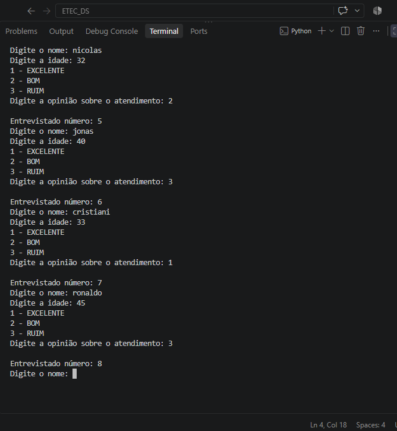

# Pesquisa de Atendimento

Atividade desenvolvida para a disciplina de Desenvolvimento de Sistemas I.

O programa realiza uma pesquisa de satisfação com 50 entrevistados.

Para cada entrevistado, são solicitados:

- Nome
- Idade
- Opinião sobre o atendimento

As opções de resposta são:

1 - EXCELENTE  
2 - BOM  
3 - RUIM  

Ao final da pesquisa, o programa exibe:

- Quantidade de respostas EXCELENTE
- Quantidade de respostas RUIM

## Estruturas utilizadas

- Estrutura de repetição `for`
- Estrutura de decisão `if` e `elif`
- Contadores
- Entrada de dados com `input`

## Execução

